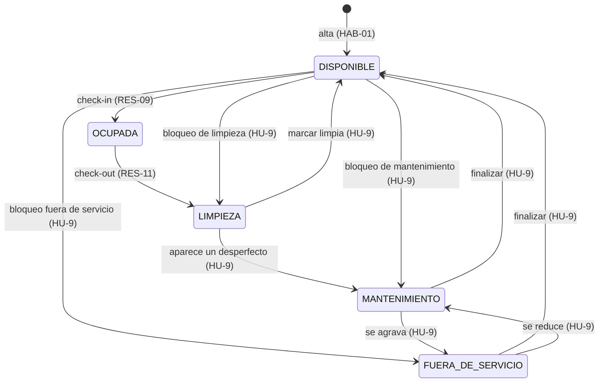

# HU-9 · HAB-06 — Mantenimiento y limpieza de habitaciones

**Sprint 3 — Reservas y Gestión de Habitaciones**
**Depende de:** HAB-01 (habitaciones)
**Se puede desarrollar en paralelo con:** RES-05 en adelante

---

## 1. Descripción funcional

> **Como** personal de Gobernanza,
> **necesito** marcar una habitación en limpieza o mantenimiento indicando fechas y motivo,
> **para** que no se ofrezca a la venta mientras no esté en condiciones, y vuelva a estar disponible apenas se termine el trabajo.

HU-9 cierra el ciclo de estados de la habitación. Sin esta historia, una habitación que sale del check-out queda en LIMPIEZA y no hay forma de devolverla a DISPONIBLE: el ciclo queda abierto y la habitación se pierde para la venta.

La historia distingue tres tipos de bloqueo, porque en un hotel no significan lo mismo:

| Tipo | Duración | ¿Impide reservas? | Ejemplo |
|---|---|---|---|
| **Limpieza** | Hasta 1 día | No | Limpieza posterior al check-out |
| **Mantenimiento** | Días | Sí, en esas fechas | Reparación de una canilla |
| **Fuera de servicio** | Prolongada | Sí, en esas fechas | Remodelación del baño |

La limpieza no impide reservas porque se resuelve en horas: la habitación se limpia a la mañana y se entrega a las 14 h al huésped que llega ese día. Si una limpieza impidiera la reserva del mismo día, el hotel no podría vender la habitación que acaba de liberarse.

---

## 2. Criterios de aceptación

**CA-1 — Alta de un bloqueo**
**Dado que** soy personal de Gobernanza y la habitación existe y está activa
**Cuando** registro un bloqueo indicando tipo, fecha de inicio, fecha estimada de finalización y motivo
**Entonces** el bloqueo queda registrado con el usuario que lo abrió
**Y** si empieza hoy, la habitación pasa al estado del bloqueo en ese momento
**Y** si empieza en una fecha futura, la habitación sigue disponible hasta ese día

**CA-2 — Solo habitaciones existentes**
**Dado que** intento bloquear una habitación
**Cuando** la habitación no existe o está dada de baja
**Entonces** el sistema rechaza la operación informando el motivo

**CA-3 — Habitación ocupada**
**Dado que** la habitación tiene un huésped alojado
**Cuando** intento bloquearla desde hoy
**Entonces** el sistema lo rechaza
**Y** permite programar el bloqueo para una fecha posterior al check-out

**CA-4 — Conflicto con reservas**
**Dado que** la habitación tiene reservas activas en ciertas fechas
**Cuando** intento abrir un mantenimiento o un fuera de servicio que se superpone con ellas
**Entonces** el sistema lo rechaza indicando el código de la reserva afectada
**Y** una limpieza no se rechaza por este motivo

**CA-5 — Transición automática a Disponible**
**Dado que** una habitación tiene un bloqueo abierto
**Cuando** finalizo el bloqueo
**Entonces** la habitación vuelve automáticamente a Disponible
**Y** si tenía otro bloqueo vigente abierto, pasa al estado de ese bloqueo en lugar de quedar disponible

**CA-6 — Limpieza posterior al check-out**
**Dado que** una habitación quedó en Limpieza tras el check-out
**Cuando** Gobernanza la marca como limpia
**Entonces** la habitación vuelve a Disponible
**Y** queda registrado quién la limpió y cuándo

**CA-7 — Historial**
**Dado que** una habitación tuvo bloqueos
**Cuando** consulto su historial
**Entonces** veo todos sus bloqueos, abiertos y cerrados, con fechas, motivos, responsables y si el cierre se atrasó respecto de lo estimado

---

## 3. Flujo de estados de la habitación



### Quién mueve cada transición

| Desde | Hacia | Historia | Mecanismo |
|---|---|---|---|
| DISPONIBLE | OCUPADA | RES-09 | trigger `tr_process_check_in` |
| OCUPADA | LIMPIEZA | RES-11 | trigger `tr_process_check_out` |
| cualquiera excepto OCUPADA | LIMPIEZA / MANTENIMIENTO / FUERA_DE_SERVICIO | **HU-9** | trigger `tr_sync_room_maintenance` al abrir un bloqueo |
| LIMPIEZA / MANTENIMIENTO / FUERA_DE_SERVICIO | DISPONIBLE | **HU-9** | trigger `tr_sync_room_maintenance` al cerrar un bloqueo |

HU-9 **nunca** mueve una habitación desde o hacia OCUPADA: esas transiciones son del check-in y del check-out. La regla está codificada en `TRANSICIONES_HU9` dentro de `housekeeping.reglas.js` y cubierta por pruebas.

---

## 4. Validaciones

| Validación | Dónde se aplica | Por qué ahí |
|---|---|---|
| La habitación existe y está activa | Service | Mensaje claro antes de tocar la base |
| No está ocupada si el bloqueo empieza hoy | Service **y** base | La base la repite: ninguna escritura externa puede saltearla |
| Tipo válido | Service **y** base (CHECK) | |
| Motivo obligatorio | Service **y** base (NOT NULL) | |
| Inicio no anterior a hoy | Service | Regla de negocio, no de integridad |
| Fin estimado ≥ inicio | Service **y** base (CHECK) | |
| Limpieza de hasta 1 día | Service | Si dura más, es un mantenimiento |
| Sin bloqueos abiertos superpuestos | Base (EXCLUDE) | Solo el motor garantiza esto con usuarios concurrentes |
| Mantenimiento sin reservas activas superpuestas | Base (trigger) | Idem |
| Cierre no futuro, no anterior al inicio | Service | |
| Un bloqueo cerrado no se vuelve a cerrar | Service | |

---

## 5. Consideraciones técnicas

### 5.1 Modelo de datos

HU-9 usa la tabla `Room_Maintenance`, que ya existe en `DB-hotel.pgsql` y en `schema.prisma`. **No se agregan tablas ni modelos**, así que no hay que regenerar el cliente de Prisma.

```prisma
model room_maintenance {
  maintenance_id     Int        @id @default(autoincrement())
  room_id            Int
  maintenance_type   String     @default("MANTENIMIENTO") @db.VarChar(20)
  start_date         DateTime   @db.Date
  estimated_end_date DateTime   @db.Date
  actual_end_date    DateTime?  @db.Date      // NULL = bloqueo abierto
  reason             String     @db.VarChar(255)
  closing_notes      String?    @db.VarChar(255)
  opened_by          Int
  closed_by          Int?
  ...
}
```

Lo que sí se agrega es el parche `10_hu9_housekeeping.sql`, que corrige tres comportamientos de los triggers de esta tabla (ver sección 7).

### 5.2 Endpoints

Base: `/api/housekeeping`. Todas las respuestas tienen la forma `{ ok, data, message }`.

| Método | Ruta | Qué hace |
|---|---|---|
| GET | `/tablero` | Habitaciones activas con su estado y bloqueo vigente. Admite `?estado=` |
| GET | `/resumen` | Cantidad de habitaciones por estado |
| GET | `/` | Bloqueos. Filtros: `?habitacion=`, `?abiertos=true`, `?tipo=` |
| GET | `/:id` | Un bloqueo con habitación y responsables |
| GET | `/habitaciones/:roomId/historial` | Todos los bloqueos de una habitación |
| POST | `/` | Abre un bloqueo |
| PATCH | `/:id/finalizar` | Cierra un bloqueo |
| POST | `/habitaciones/:roomId/limpia` | Acción rápida: marca limpia una habitación en LIMPIEZA |

**POST /api/housekeeping**

```json
{
  "room_id": 3,
  "maintenance_type": "MANTENIMIENTO",
  "start_date": "2026-09-22",
  "estimated_end_date": "2026-09-24",
  "reason": "Pérdida en la canilla del baño"
}
```

**PATCH /api/housekeeping/:id/finalizar**

```json
{ "closing_notes": "Se cambió el cuerito" }
```

`actual_end_date` es opcional; si no se envía, se usa la fecha de hoy.

### 5.3 Lógica de actualización del estado

**El estado de la habitación lo mueve la base, no el backend.** El service solo inserta y cierra bloqueos; el trigger `tr_sync_room_maintenance` cambia `room_status`. Si el backend hiciera dos escrituras separadas —registrar el bloqueo y actualizar la habitación— un error entre ambas dejaría el bloqueo registrado y la habitación en su estado anterior.

**La acción "Marcar limpia"** resuelve el caso más frecuente del turno. El check-out (RES-11) deja la habitación en LIMPIEZA **sin abrir un bloqueo**, así que no hay nada que cerrar. El service lo resuelve así, dentro de una transacción:

1. Si existe un bloqueo de limpieza abierto, lo cierra.
2. Si no existe —es la habitación que salió del check-out—, crea el bloqueo y lo cierra.

Al cerrarse, el trigger devuelve la habitación a DISPONIBLE. Crear y cerrar el registro, en lugar de cambiar el estado directamente, deja constancia de quién limpió y cuándo.

### 5.4 Arquitectura del módulo

```
backend/src/modules/housekeeping/
  housekeeping.reglas.js      reglas puras: estados, transiciones, validaciones
  housekeeping.service.js     acceso a datos y transacciones
  housekeeping.controller.js
  housekeeping.routes.js

backend/tests/
  housekeeping.reglas.test.js 22 pruebas, sin base de datos
```

Las reglas viven separadas del service para poder probarlas sin levantar PostgreSQL. Es el mismo patrón usado en `comprobantes.reglas.js`.

**Independencia:** el módulo lee `room` directamente con Prisma y no importa nada de HAB-01, HAB-03 ni RES-*. Funciona hoy con las habitaciones de la semilla, y cuando el resto del equipo suba sus módulos no hay que modificarlo.

### 5.5 Frontend

```
frontend/src/app/habitaciones/housekeeping/page.tsx     pantalla de housekeeping
frontend/src/components/housekeeping/BloqueoForm.tsx    alta de bloqueo
frontend/src/lib/housekeeping.ts                        tipos y etiquetas
```

La pantalla tiene tres zonas:

- **Resumen por estado**: cinco tarjetas con la cantidad de habitaciones en cada estado. Tocar una filtra el tablero.
- **Tablero de habitaciones**: una tarjeta por habitación con la acción que corresponde según su estado.
- **Bloqueos abiertos**: tabla con los bloqueos vigentes y programados, marcando los atrasados.

| Estado | Acción disponible |
|---|---|
| DISPONIBLE | Bloquear |
| LIMPIEZA | Marcar limpia · Bloquear |
| MANTENIMIENTO | Finalizar · Bloquear |
| FUERA_DE_SERVICIO | Finalizar |
| OCUPADA | Programar (solo a futuro) |

El filtro por defecto es **Pendientes**: al abrir la pantalla, Gobernanza ve directamente lo que tiene que resolver. Las habitaciones que salieron del check-out se destacan con borde de advertencia.

---

## 6. Integración con el resto del sprint

### 6.1 Con el panel HAB-04

La vista `v_room_type_panel` ya cuenta las habitaciones disponibles por tipo, así que **refleja los bloqueos de HU-9 sin cambios**: una habitación en mantenimiento deja de sumarse en `available_rooms`.

Lo que el panel no muestra es por qué no están disponibles. Propuesta para quien tenga HAB-04, a acordar antes de aplicarla:

```sql
-- Agregar al SELECT de v_room_type_panel
COUNT(r.room_id) FILTER (WHERE r.active AND r.room_status = 'OCUPADA')           AS occupied_rooms,
COUNT(r.room_id) FILTER (WHERE r.active AND r.room_status = 'LIMPIEZA')          AS cleaning_rooms,
COUNT(r.room_id) FILTER (WHERE r.active AND r.room_status IN
                         ('MANTENIMIENTO', 'FUERA_DE_SERVICIO'))                 AS blocked_rooms
```

Con eso el panel puede decir "Dobles: 6 activas, 2 disponibles, 2 ocupadas, 1 en limpieza, 1 bloqueada", que es lo que el gerente necesita para entender la ocupación real.

Mientras tanto, el endpoint `GET /api/housekeeping/resumen` ya devuelve esos totales y puede consumirse desde HAB-04 sin tocar la vista.

### 6.2 Con el ciclo general

```
HAB-01  alta de habitación ─────────────────────────► DISPONIBLE
RES-09  check-in ────────────────────────────────────► OCUPADA
RES-11  check-out ───────────────────────────────────► LIMPIEZA
HU-9    marcar limpia ───────────────────────────────► DISPONIBLE   ← cierra el ciclo
```

---

## 7. Puntos a coordinar con el equipo

**Corregido dentro del alcance de HU-9** (parche `10_hu9_housekeeping.sql`):

1. **Bloqueos programados a futuro.** Cambiaban el estado de la habitación al cargarlos: si hoy se programaba una pintura para la semana siguiente, la habitación dejaba de venderse una semana antes. Ahora solo cambia el estado si el bloqueo empieza hoy.
2. **Cierre con otro bloqueo abierto.** Al finalizar un bloqueo, la habitación volvía a DISPONIBLE aunque tuviera otro vigente. Ahora pasa al estado del que queda abierto.
3. **Limpieza contra reservas.** Una limpieza en el día bloqueaba la reserva que entraba ese mismo día.

**Pendiente de otras historias** — no se modificó para respetar la independencia:

4. **RES-05 y RES-01 tratan la limpieza como bloqueo de fechas.** `fn_available_rooms()` y `fn_validate_reservation()` descartan una habitación con *cualquier* bloqueo abierto, incluida una limpieza. Resultado: una habitación que se está limpiando hoy no aparece en la búsqueda de disponibilidad para hoy. La corrección es agregar `AND rm.maintenance_type <> 'LIMPIEZA'` en ambas funciones. Conviene que lo aplique quien tenga RES-05, para no pisar su trabajo.
5. **Job diario.** Los bloqueos programados necesitan que alguien ejecute `SELECT fn_activate_scheduled_maintenance();` una vez por día. Es el mismo job que necesita `fn_process_no_shows()` de RES-09, así que conviene definirlo una sola vez para las dos.
6. **Check-out sin bloqueo.** RES-11 deja la habitación en LIMPIEZA sin abrir un bloqueo. HU-9 ya contempla este caso con "Marcar limpia", así que **no hace falta cambiar RES-11**. Si se quiere que el check-out registre la limpieza pendiente desde el principio, es una mejora opcional.

---

## 8. Instalación

```powershell
cd "C:\Users\Enzo Liendro\Desktop\hotel-test"
$env:Path += ";C:\Program Files\PostgreSQL\17\bin"
$env:PGCLIENTENCODING = "UTF8"

psql -U postgres -d sistema_hotelero_db -f database/10_hu9_housekeeping.sql

cd backend
npm test
npm run dev
```

No hace falta `prisma generate`: HU-9 no agrega modelos.

En `backend/src/app.js`, junto a los demás módulos:

```js
const housekeepingRoutes = require('./modules/housekeeping/housekeeping.routes');
// ...
app.use('/api/housekeeping', housekeepingRoutes);
```

En `frontend/src/lib/navegacion.ts`, un grupo nuevo:

```ts
{
  nombre: "Habitaciones",
  ruta: "/habitaciones",
  hijos: [
    { nombre: "Housekeeping", ruta: "/habitaciones/housekeeping" },
    // HAB-01, HAB-03 y HAB-04 se suman acá cuando estén disponibles
  ],
},
```

### Prueba del circuito

```sql
-- 1. Bloquear la 103 por mantenimiento desde hoy
INSERT INTO Room_Maintenance (room_id, maintenance_type, start_date, estimated_end_date, reason, opened_by)
VALUES ((SELECT room_id FROM Room WHERE room_number = '103'), 'MANTENIMIENTO', CURRENT_DATE, CURRENT_DATE + 2,
        'Prueba HU-9', 1);

SELECT room_number, room_status FROM Room WHERE room_number = '103';   -- MANTENIMIENTO

-- 2. Finalizarlo
UPDATE Room_Maintenance
SET actual_end_date = CURRENT_DATE, closed_by = 1
WHERE reason = 'Prueba HU-9';

SELECT room_number, room_status FROM Room WHERE room_number = '103';   -- DISPONIBLE
```
